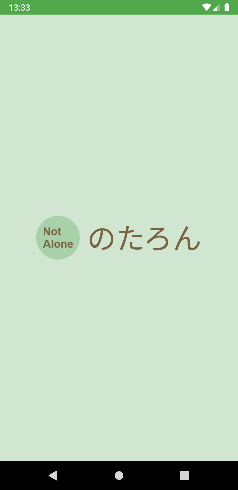
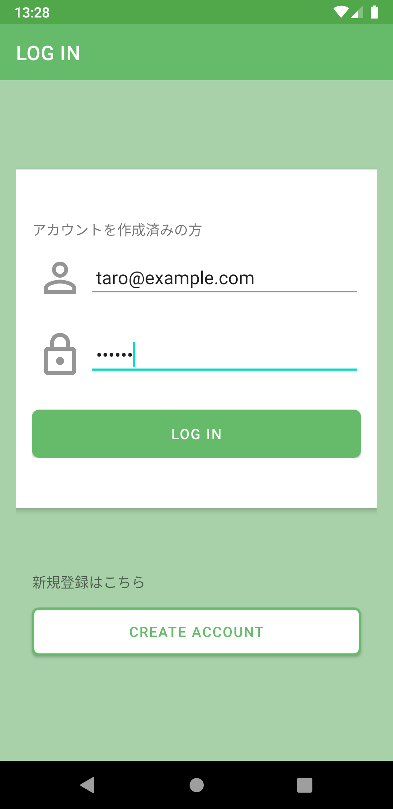
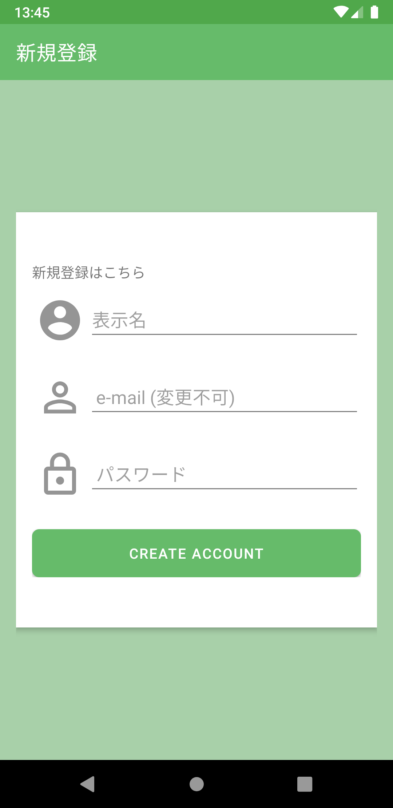
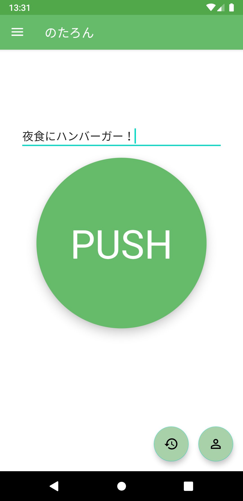
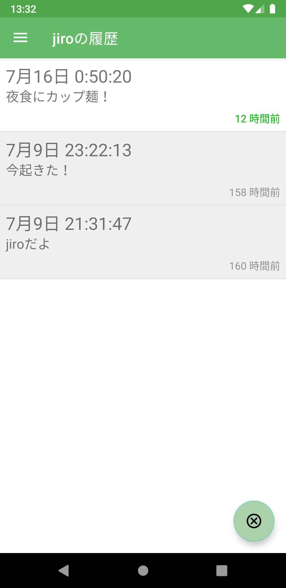
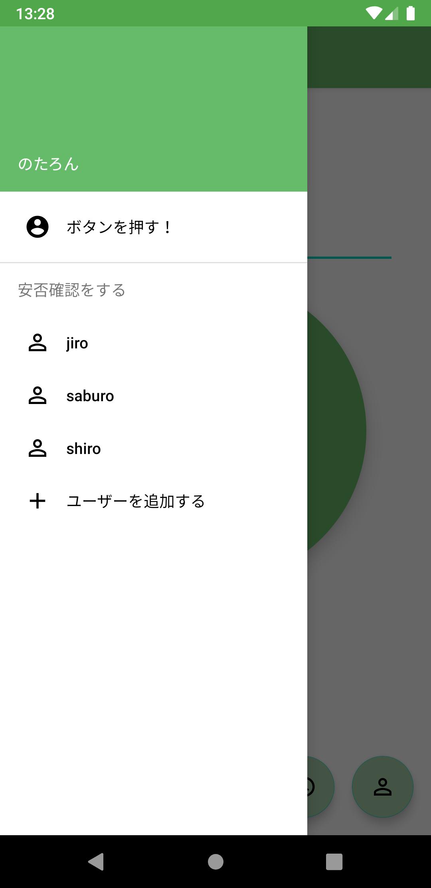

# のたろん - Notalone

鋭意開発中で、機能追加や改善を行っている段階です。将来的にはリリースします。

ボタン一つで安否の報告が可能なアプリです。「安否確認SNS」として、一人暮らしをしている人と、それを心配している人たちに安心を届けられます。

## ログイン・新規登録画面
アカウントを作成することで、必要な人にのみ情報が見られるようにしています。

  
  

## ボタンを押す画面
真ん中に押しやすいボタンが一つ表示されています。これを押すだけでその時間の情報が保存され、安否を報告することができます。

また、普段メッセージングアプリで言うほどでもないことを言いやすい場にもなっているため、コメントを付ける機能も搭載しています。

## 履歴を閲覧する画面
ボタンが押された履歴を閲覧する画面では、いちばん重要な最新の履歴が何時間前のものなのか、ひと目でわかるようになっています。

また、左側のドロワーメニューを開くことにより、ボタン画面や他のユーザの履歴画面へ遷移することができます。

  
  

